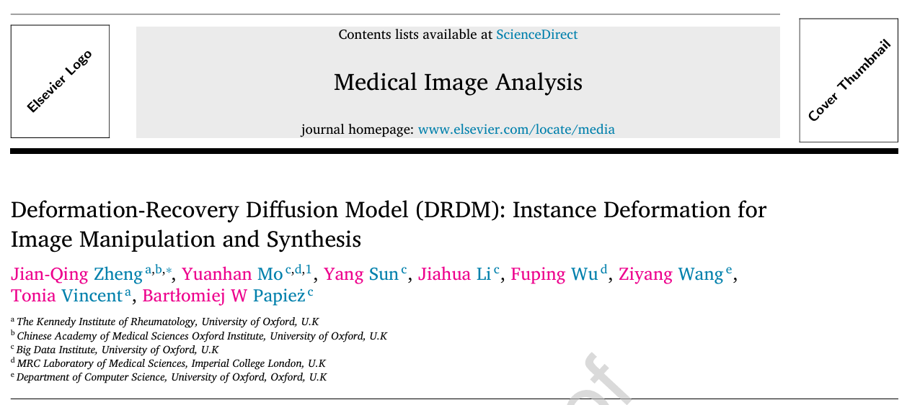
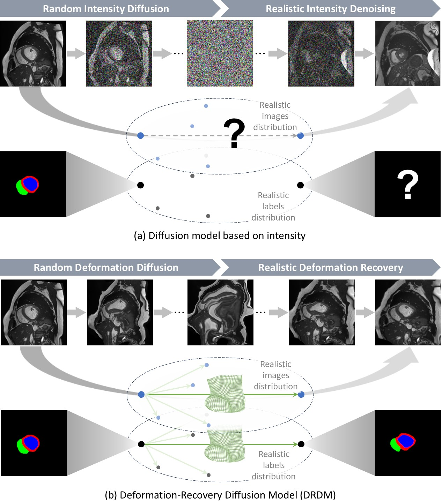
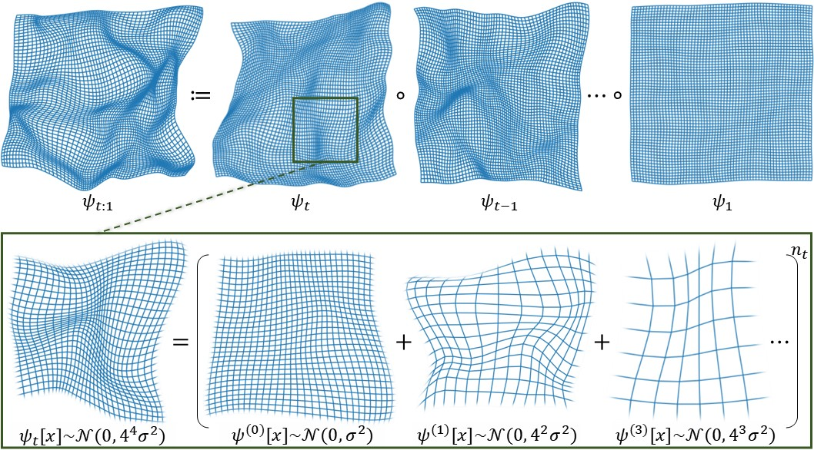
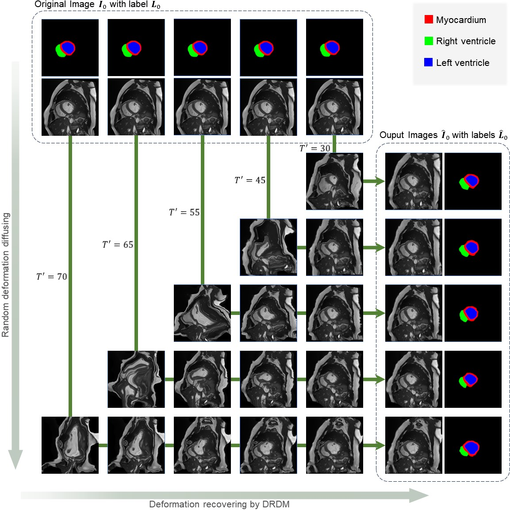
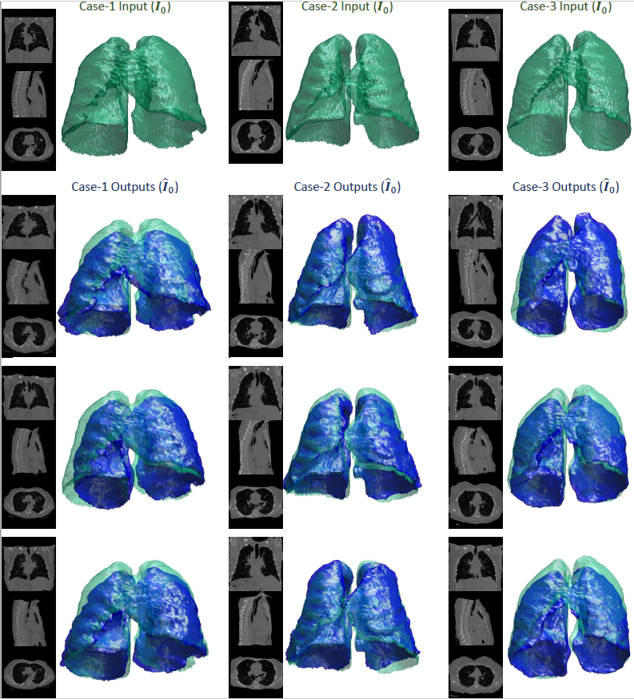
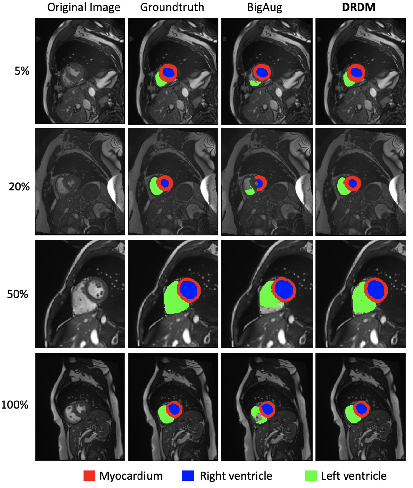
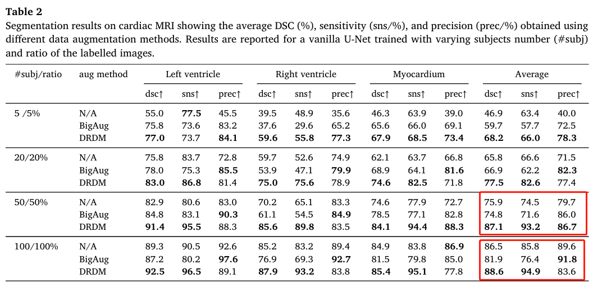
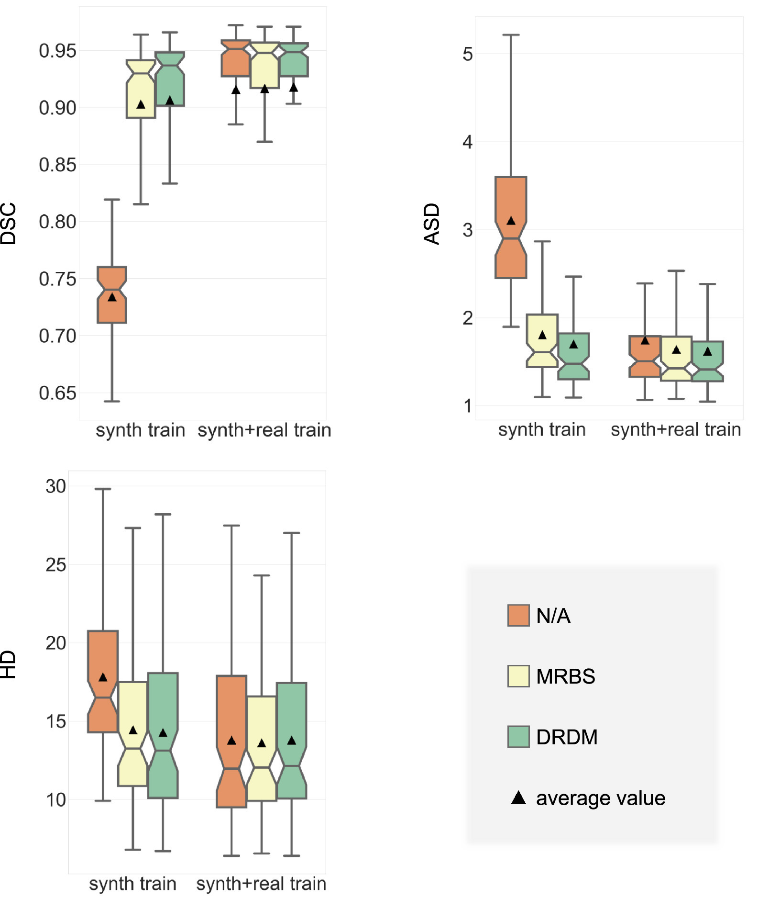

# 医工顶刊MedIA2026|基于形变恢复扩散模型（DRDM）的实例形变图像生成与编辑 #

在医学成像领域，图像生成与编辑是现代人工智能的重要应用，尤其在数据增强、少样本学习和分类分割等任务中具有重要意义。然而，现有扩散模型在医学图像中的应用常面临几个核心问题：
1. **生成图像与真实解剖结构缺乏可解释与可靠的关联性**。
2. **因此无法保留像素级别的语义信息，进而无法用于针对诸如图像分割等的像素级别任务做数据增强与合成**。
3. **现有基于像素加噪去噪的扩散模型方法容易生成不真实的伪影与粗糙的细节，进而影响下游任务，尤其是像素级别任务的效果**。
4. **此外，当前所谓的“形变扩散模型”普遍依赖配准模型与图谱构建，本质上仍局限于在已有图像间进行形态学插值，难以实现真正的形变生成及其对应图像的生成与编辑。**

因此牛津大学研究团队提出了一种全新的扩散生成模型，**形变恢复扩散模型（Deformation-Recovery Diffusion Model, DRDM）**，旨在通过在形变空间中实现随机形变扩散与恢复过程生成形变场，而非依赖像素变化或配准/图谱框架。通过这一全新机制，DRDM能有效突破现有方法局限，为医学图像生成更具有**可解释性、语义一致性与多样性**并存的解决方案。

> ### 核心创新点 ###
> 1. **实例特异性形变生成**：
>   **DRDM**首次提出在无需参考图像的情况下，为单张图像生成多样化且合理的形变。
> 2. **形变扩散模型**：
>   基于形变的扩散与恢复过程，取代传统像素值或隐空间特征扩散模型。
> 3. **多尺度随机形变速度场采样与整合**：
>   通过多尺度形变速度流场采样与路径积分，生成微分同胚且物理合理的随机形变场以训练**DRDM**。
> 4. **无标注自监督训练**：
>   **DRDM**无需人工标注或外部模型支撑，能够从零开始完成训练。
> 5. **下游任务提升**：
>   基于**DRDM**增强后，在下游任务包括少样本学习的心脏MRI结构分割与肺部CT配准中均有明显提升。此外，基于真实分布的增强方法不会引入噪声，从而避免了随机增强在多样本中带来的性能下降问题。

> - **论文链接**：[https://doi.org/10.1016/j.media.2026.103987](https://doi.org/10.1016/j.media.2026.103987)
> - **预印本链接** [https://arxiv.org/abs/2407.07295](https://arxiv.org/abs/2407.07295)
> - **项目地址**：[https://jianqingzheng.github.io/def_diff_rec/](https://jianqingzheng.github.io/def_diff_rec/)

## 研究背景 ##

扩散模型因其高质量数据生成能力和可扩展性，已在医学图像合成中得到广泛应用。然而，传统扩散模型以像素值或特征为基础，缺乏对形态学变化的建模能力。在医学图像分析中，特别是强调解剖结构的图像生成与编辑，准确捕捉形态和形变特征至关重要。

**DRDM**通过构建形变场生成与恢复机制，利用微分同胚的形变场生成方法，随机采样多尺度形变速度流场（Deformation Velocity Fields, DVFs）并将其路径积分，使模型能够从随机形变恢复到真实分布，从而生成多样且解剖学合理的形变。

## 方法设计 ##

### 框架设计 ###

**DRDM**框架由 形变扩散（Deformation Diffusion）与 形变恢复（Deformation Recovery）两部分组成：
- **形变扩散**：通过固定的马尔科夫过程，随机生成形变场。
- **形变恢复**：递归估计并恢复形变场，使得随机形变图像回归真实形变分布。

### 形变扩散 ###
其中形变扩散基于三点假设：
1. **随机性**：要求每个位置的形变向量应符合均匀正态分布；
2. **局部性**：要求连续介质的形变场应保持连续性，定义为在局部区域内的任意两点向量差值满足受限于与该两点距离相关的正态分布；
3. **可逆性**：要求生成的形变场应物理可逆（微分同胚），通过雅可比矩阵的行列式的负值比例来表示。

因此在该文章中设计了一种多尺度的随机速度流场采样，并通过积分得到最终的随机形变流场：

### 形变恢复 ###
基于生成的形变流场，**DRDM**在训练过程中学习形变扩散中的向量场分布，并生成对应的逆向量场，从而恢复模型认为不合理的形变分量：

从而生成针对该图像合理且具有多样性的形变场：

## 实验与结果 ##

### 数据集 ###
本文在两个医学图像模态中验证了**DRDM**的性能：
1. **心脏MRI**：使用公开的心脏数据集（包括Sunnybrook、M&Ms、LASC、SCD等）。
2. **肺部CT**：使用公开肺部CT数据集（包括NSCLC-Radiomics、Learn2Reg等）。

### 图像合成与形变场评估 ###
实验显示，**DRDM**生成的形变场具有以下特点：
- **高多样性**：支持大规模形变（图像尺寸10%以上）。
- **高质量**：Jacobian矩阵负值比例低于1%，保证形变的物理合理性。
- **可控性**：通过调节初始随机形变场可以有效控制最终生成的形变程度。

### 下游任务验证与改进 ###
1. **医学图像分割**：
   - **DRDM**生成的合成数据用于少样本学习，显著提升分割准确性。
   - 相比传统数据增强方法（如BigAug），**DRDM**能够提供更高的多样性和更贴近医学的相关性，从而在Dice系数（DSC）、平均表面距离（ASD）等指标上获得显著提升。

值得注意的是，在标记样本数量充足情况下，如50%-100%的训练数据，基线数据增强方法（BigAug）由于引入了额外噪音，与无增强相比反而造成了分割模型性能的下降，而**DRDM**仍然可以带来显著提升。该结果也进一步印证了**DRDM**生成数据更符合真实图像分布规律。

2. **图像配准**：
   - **DRDM**生成的形变场作为配准模型的合成训练数据，提升了肺部CT的配准性能。
   - 实验结果表明，仅使用**DRDM**生成的数据已能够接近使用真实数据训练的配准性能。
   - 在基于使用**DRDM**生成的数据训练后进一步微调能够进一步提升。

## 结论 ##

- 提出形变恢复扩散模型**DRDM**，解决医学图像生成中形态学建模的核心难题。
- 提供无标注形变生成的新方法，简化了医学图像数据增强与合成的流程。
- 在医学图像分割与配准任务中，证明了**DRDM**的高效性与实用性。

## 展望 ##

**DRDM**不仅可以用于数据增强与合成，还可以扩展至更多场景：
- **条件形变生成**：结合条件输入，生成特定类型的形变场。
- **多模态图像合成**：结合模态转换模块，实现跨模态图像形变生成。
- **动态图像/视频生成一致性**：与传统扩散模型结合，解决动态影像或视频生成中的纹理不一致问题。

> 扫描下方二维码查看DRDM项目主页：

